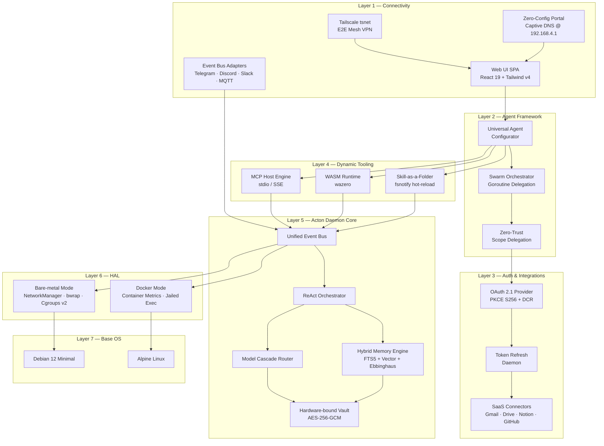

<div align="center">


# ActonOS

**Extensible AI Agent Operating System Kernel**

[](https://go.dev)
[](https://react.dev)
[](LICENSE)
[&label=version&style=flat-square&color=green)](VERSION)

A single-purpose appliance OS designed as a **customizable, self-governing agent kernel** that runs 24/7. ActonOS keeps its core daemon (`actond`) statically linked and packages local ONNX inference as a loopback-only helper for **bare-metal MiniPCs** and **Docker containers**.

[Architecture](docs/ARCHITECTURE.md) · [Development](docs/DEVELOPMENT.md) · [Deployment](docs/DEPLOYMENT.md) · [API Reference](docs/API.md) · [Contributing](docs/CONTRIBUTING.md)

</div>

---

## Key Features

| Feature | Description |
|:---|:---|
| **Static Core Daemon** | The core system compiles into one `actond` binary (`CGO_ENABLED=0`); local ONNX inference runs in a separately packaged loopback helper. |
| **Universal Agent Engine** | Create unlimited AI agents with custom personas, system prompts, tool bindings, LLM models, and delegation scopes. |
| **Multi-Agent Swarm** | Agent-to-Agent delegation via Goroutines. Orchestration agents decompose tasks and dispatch to specialized sub-agents. |
| **Dynamic Tooling Hub** | Hot-load MCP servers, WASM plugins, and Skill-as-a-Folder scripts at runtime — no restarts needed. |
| **Dual-Runtime HAL** | Automatic environment detection: bare-metal (D-Bus, Wi-Fi Hotspot, Bubblewrap sandbox) or Docker (container metrics, jailed exec). |
| **Hybrid Memory (RAG)** | SQLite FTS5 + Chromem-go vectors generated locally by pinned multilingual-e5-small ONNX, with a durable one-minute debounce queue. |
| **Enterprise Auth** | OAuth 2.1 PKCE (S256), Dynamic Client Registration, background token refresh daemon. |
| **Immutable OS Design** | Read-only system partition, all user data under `/data`. Atomic OTA updates with watchdog auto-rollback. |
| **Zero-Config Onboarding** | Captive portal Wi-Fi setup, API key entry, OAuth 1-click SaaS connection, Tailscale mesh VPN. |
| **Embedded Tailscale** | Native `tsnet` integration for end-to-end encrypted remote access without port forwarding. |

## Architecture Overview



## Quick Start

### Docker (Recommended)

```bash
docker run -d \
  --name actonos \
  -p 8080:8080 \
  -v ./acton-data:/data \
  -e RUNTIME_MODE=docker \
  --restart unless-stopped \
  actonos/actonos:latest
```

Open `http://localhost:8080` to access the dashboard.

### Bare-metal MiniPC

1. Download the latest `ActonOS-vX.Y.Z.iso` from [Releases](https://github.com/actonos/actonos/releases)
2. Flash to USB: `dd if=ActonOS-v1.0.0.iso of=/dev/sdX bs=4M status=progress`
3. Boot the MiniPC from USB — installation is fully automated
4. Connect to the `ActonOS-XXXX` Wi-Fi hotspot and follow the setup wizard

## Development

### Prerequisites

| Tool | Version | Purpose |
|:---|:---|:---|
| Go | 1.23+ | Backend daemon |
| Node.js | 22 LTS+ | Frontend build |
| Make | 4.0+ | Build orchestration |
| Docker | 24+ | Container builds (optional) |

### Getting Started

```bash
# Clone the repository
git clone https://github.com/actonos/actonos.git
cd actonos

# Install dependencies
make deps

# Run in development mode (backend + frontend hot-reload)
make dev

# Run tests
make test

# Build production binary
make build
```

See [docs/DEVELOPMENT.md](docs/DEVELOPMENT.md) for the full A-Z development guide.

## Project Structure

```
actonos/
├── cmd/actond/              # Binary entrypoint (auto-detects bare-metal vs Docker)
├── cmd/embeddingd/          # Loopback multilingual-e5-small ONNX helper
├── internal/
│   ├── agent/               # AI Agent Engine, Swarm, Planner, Verifier, Memory Reflection
│   ├── auth/                # OAuth 2.1 PKCE, Token Refresh, Delegation Manager
│   ├── bus/                 # Event-Driven Pub/Sub Channel Router
│   ├── channels/            # Telegram, Discord, Webhook adapters
│   ├── llm/                 # LLM Provider Interface & Cascade Router
│   ├── tools/               # MCP Host, WASM Runner, Skill Watcher, Native Tools
│   ├── sandbox/             # Bubblewrap (bare-metal) & Subshell (Docker) executors
│   ├── memory/              # Durable embedding queue, SQLite FTS5, Chromem, decay, Vault
│   ├── system/              # HAL, Tailscale tsnet, OTA, Hardware Metrics
│   └── server/              # HTTP Router, WebSocket, REST APIs, Static Asset Server
├── web/                     # React 19 + Tailwind v4 + Vite frontend
├── deploy/
│   ├── docker/              # Dockerfile & docker-compose.yml
│   └── live-build/          # Debian live-build ISO generation
├── scripts/                 # Dev tools, version bump, changelog, build scripts
├── docs/                    # Architecture, Development, Deployment, API, Security
├── Makefile                 # Unified build pipeline
├── VERSION                  # Source-of-truth version (SemVer)
└── CHANGELOG.md             # Keep a Changelog format
```

## Tech Stack

| Subsystem | Technology | Rationale |
|:---|:---|:---|
| Core Daemon | Go (CGO_ENABLED=0) | Single static binary, Goroutine concurrency, instant startup |
| Frontend | React 19 / Tailwind v4 / Vite | Embedded via `go:embed`, compressed bundle <2 MB |
| Remote Access | Tailscale `tsnet` | Embedded mesh VPN node, E2E encrypted, no port forwarding |
| Tool Protocol | Model Context Protocol (MCP) | Open standard for LLM tool integration via stdio/SSE |
| Plugin Runtime | wazero (WASM) | Pure Go WebAssembly runtime, no CGO, sandboxed execution |
| Auth | OAuth 2.1 (PKCE S256) | Industry-standard SaaS authentication |
| Sandbox | Bubblewrap + Cgroups v2 | Namespace isolation, resource limits (512 MB RAM, 50% CPU, 30 PIDs) |
| Storage | modernc.org/sqlite + chromem-go | Embedded relational DB (FTS5) + vector search, zero external deps |
| Vault | AES-256-GCM + Argon2id | Hardware-bound encryption using DMI UUID + CPU serial |
| Base OS | Debian 12 Minimal / Alpine Linux | Bare-metal driver support / minimal container image |

## Contributing

We welcome contributions! Please read our [Contributing Guide](docs/CONTRIBUTING.md) for details on:

- Code style and conventions
- Branch naming and commit message format (Conventional Commits)
- Pull request process
- Release workflow

## Security

For security vulnerabilities, please see our [Security Policy](docs/SECURITY.md). Do **not** file public issues for security bugs.

## License

ActonOS is licensed under the [Apache License 2.0](LICENSE).

```
Copyright 2026 ActonOS Contributors

Licensed under the Apache License, Version 2.0 (the "License");
you may not use this file except in compliance with the License.
You may obtain a copy of the License at

    http://www.apache.org/licenses/LICENSE-2.0
```
