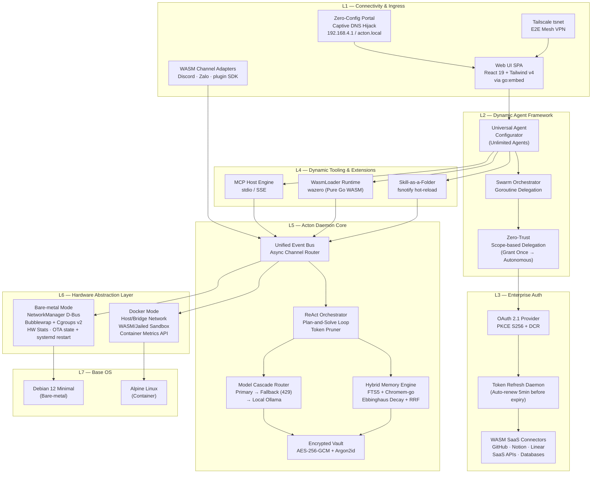
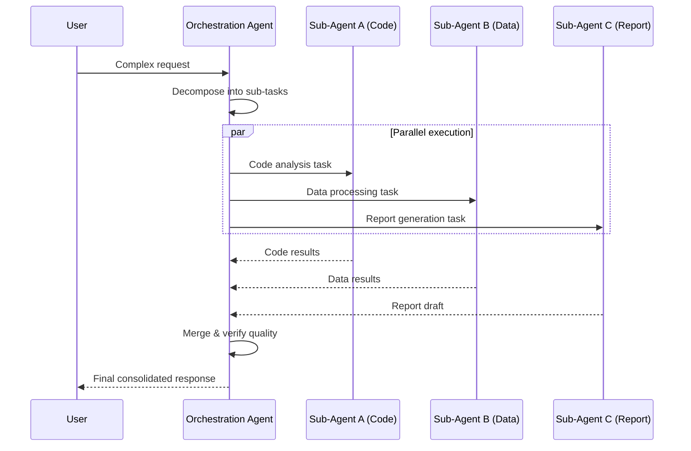
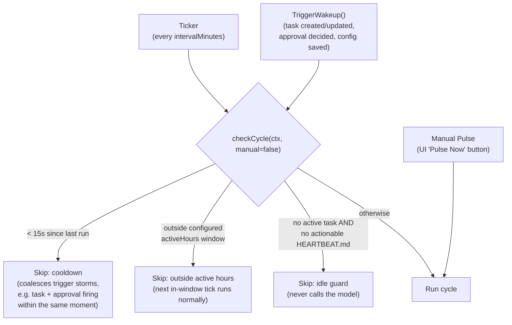
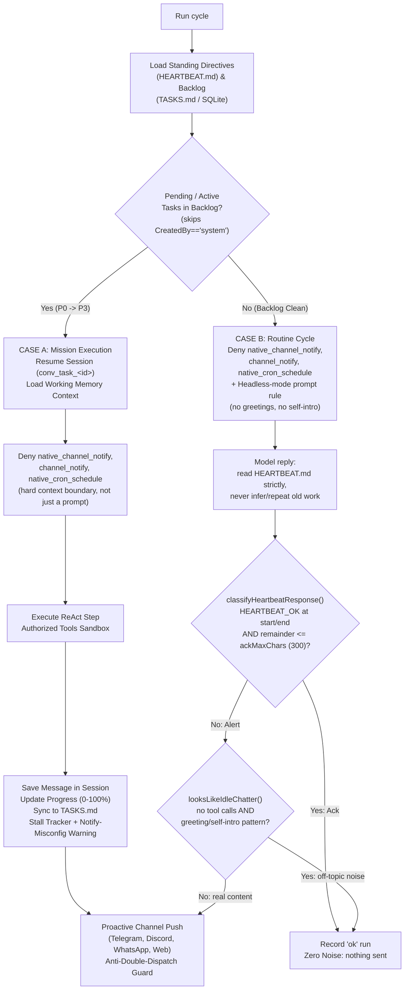
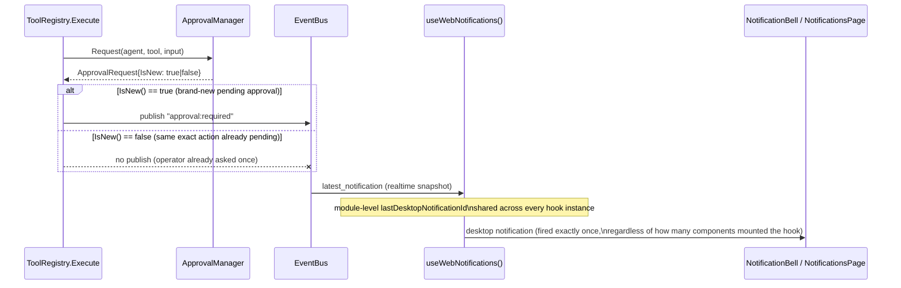
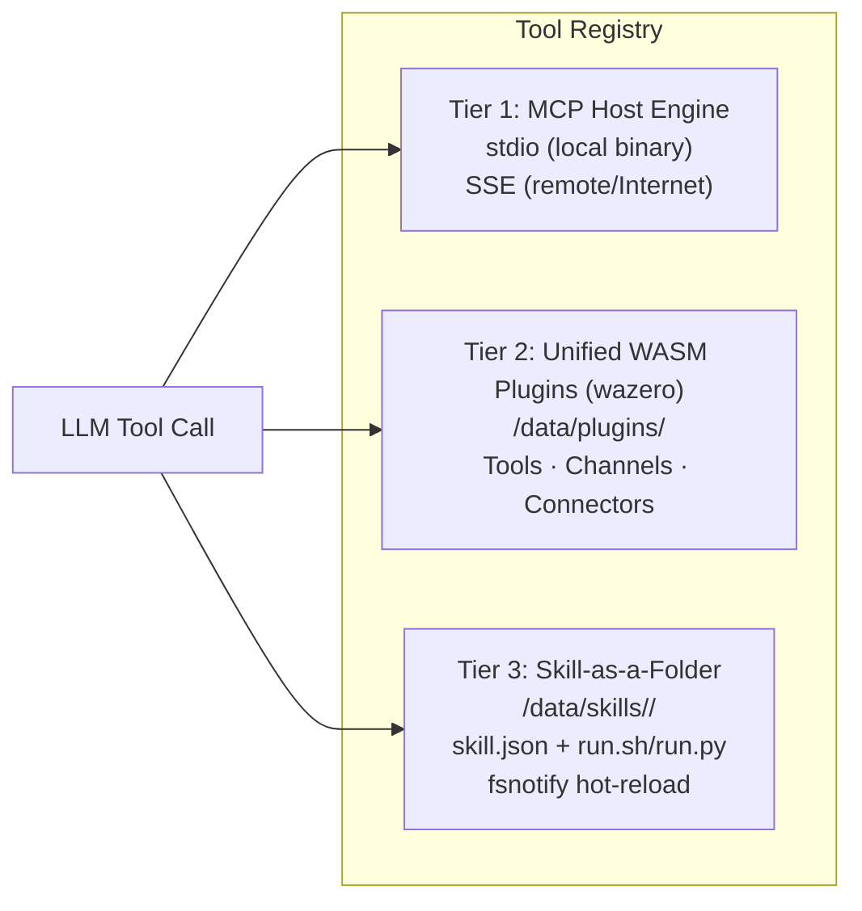
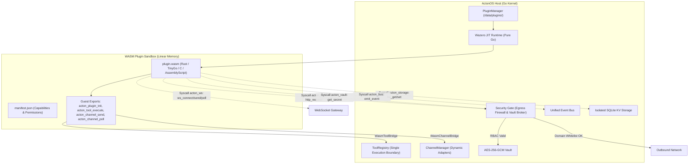
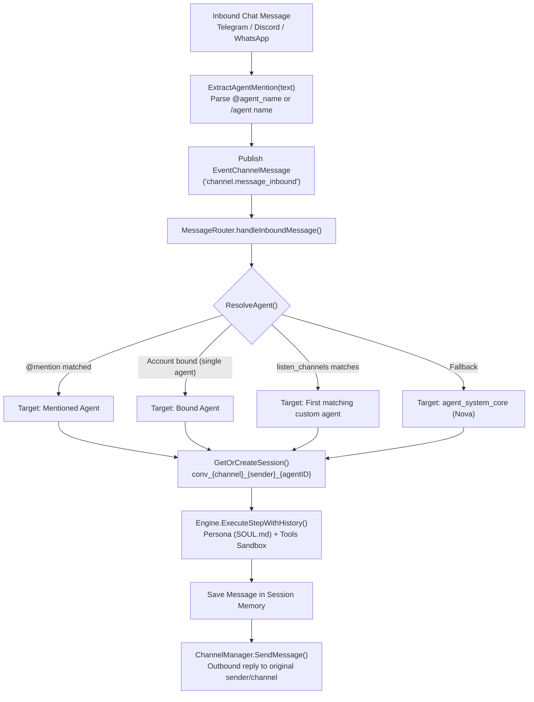
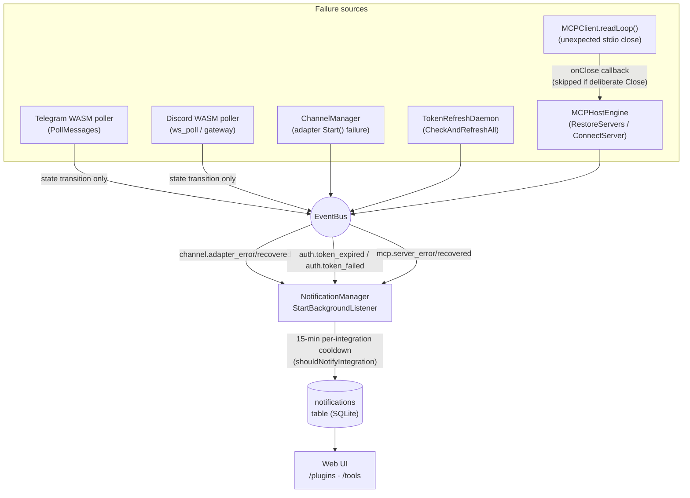
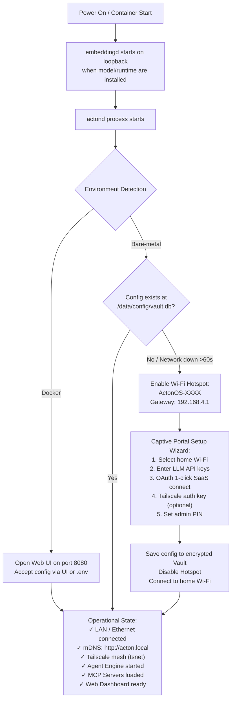

# ActonOS Architecture

> **Comprehensive Technical Architecture Specification**
> for the ActonOS Extensible AI Agent Operating System Kernel

---

## Table of Contents

- [1. Design Philosophy & Foundational Principles](#1-design-philosophy--foundational-principles)
- [2. Computational Cognition Models](#2-computational-cognition-models)
- [3. Master System Architecture](#3-master-system-architecture)
- [4. Universal Agent Framework](#4-universal-agent-framework)
- [5. Dynamic Tooling Hub](#5-dynamic-tooling-hub)
- [6. Security, Sandboxing & Audit Logging](#6-security-sandboxing--audit-logging)
- [7. Disk Partitioning & Dual-Runtime Model](#7-disk-partitioning--dual-runtime-model)
- [8. Onboarding & Operational Lifecycle](#8-onboarding--operational-lifecycle)
- [9. Self-Healing OTA Update System](#9-self-healing-ota-update-system)

---

## 1. Design Philosophy & Foundational Principles

ActonOS is a **single-purpose appliance operating system** engineered as a customizable, self-governing AI agent kernel running 24/7. It does not hardcode roles or fixed tasks — instead, it provides an absolutely flexible infrastructure allowing users to create, configure, authorize, and extend any AI agent.

### Core Principles

| Principle | Description |
|:---|:---|
| **Single Static Binary** | The entire system — Agent Core, Web Server, Database, RAG Engine, Integration Hub, Web UI — compiles into a single static binary (`actond`) with `CGO_ENABLED=0`. |
| **Minimal Resource Footprint** | Idle RAM consumption of **20–40 MB**, Web UI boot time under **2 seconds** on Intel N-Series (N100/N95) or AMD Ryzen CPUs. |
| **Universal Agent Engine** | Unlimited agent creation. Users define persona, system prompt, tool bindings, delegation scopes, and LLM model per agent via Dashboard or REST API. |
| **Multi-Agent Swarm** | Agent-to-Agent delegation via Goroutines. A primary orchestration agent spawns specialized sub-agents for parallel long-running task chains. |
| **Dual-Runtime Model** | Hardware Abstraction Layer (HAL) auto-detects bare-metal (Wi-Fi, D-Bus, bwrap) vs. Docker (container metrics, jailed exec). |
| **Immutable OS** | User data and agent configs reside in `/data`. Atomic OTA symlink swap persists `{active, previous}` so an operator or `OTAEngine.Rollback()` can restore the prior binary; systemd `Restart=always` restarts a crashed daemon. |
| **International Standards** | Deep integration with Model Context Protocol (MCP), OAuth 2.1 PKCE (S256), WebAssembly (WASM), and embedded Tailscale (`tsnet`). |

---

## 2. Computational Cognition Models

ActonOS provides a self-adjusting cognitive infrastructure for every user-created agent.

### A. Multi-Layered Memory Architecture

| Layer | Data Type | Storage Mechanism |
|:---|:---|:---|
| **Working Memory** | Scratchpad, current task state, temp variables, tool call results | In-memory (Goroutine context), freed on task completion |
| **User Profile Memory** | User profile, communication style, naming conventions, preferences | Auto-extracted via Async Reflection → Key-Value JSON + SQLite |
| **Procedural Memory** | Error handling history, optimized command sequences (best practices) | Stored as Workflow Patterns, injected into System Prompt on similar tasks |
| **Episodic Memory** | Past conversation/task journals with timestamps | SQLite FTS5 + Chromem-go vector indexing |

Semantic indexing uses a durable SQLite queue. Web chat, WASM channel
plugins, and workspace file mutations upsert a job keyed by source. Repeated
changes reset `due_at` to one minute after the latest mutation and increment a
generation, so bursts produce one final embedding. File deletion tombstones
the semantic source immediately and removes its Chromem vectors when the
delayed delete job runs.

`actond` remains a static `CGO_ENABLED=0` binary. Local inference runs in the
loopback-only `embeddingd` helper because ONNX Runtime requires CGO and a native
shared library:

```text
actond -> http://127.0.0.1:8091 -> embeddingd -> ONNX Runtime
   |                                      |
   +-> SQLite embedding_jobs              +-> multilingual-e5-small
   +-> Chromem semantic_documents             revision 614241f..., 384 dims
```

The E5 contract uses `query:` and `passage:` prefixes, attention-mask mean
pooling, L2 normalization and a 512-token limit. Activation is generation-safe:
the previous source generation remains searchable until all new vectors have
been written. A missing helper does not stop `actond`; lexical FTS5 retrieval
remains available while queued work retries with backoff.

### B. Ebbinghaus Forgetting Curve Decay & Tiered Memory Pinning

Each memory fragment's retrieval score is computed using:

```
R(m, q, t) = α · D(t) · W_tier(m) + β · CosSim(Embed(q), Embed(m))
```

Where:
- `D(t) = e^(-Δt/λ)` — Temporal decay factor (Δt = time since last retrieval, λ = decay half-life)
- `W_tier(m)` — Importance tier multiplier:
  - `critical` (3.0x): Immutable core operating rules and security policies.
  - `user_preference` (2.5x): User communication preferences, themes, and declared personal styles.
  - `high` (1.5x): Verified procedural playbooks and frequently accessed architectural facts.
  - `normal` (1.0x): Standard episodic conversational journals.
  - `low` (0.5x): Ephemeral observations subject to rapid decay and reflection cleanup.
- **Memory Pinning (`pinned=true` / `user_pinned=true`)**: Pinned memories completely bypass temporal decay (`D(t) = 1.0`) and are permanently protected from automated reflection pruning.
- `CosSim(...)` — Cosine similarity between query and memory embeddings.
- `α, β` — Normalized weights satisfying `α + β = 1`.

### C. ReAct Execution Loop & Context Shield

Agents run a bounded ReAct loop (tool use + observation) with cascade failover, circuit-breaking, guaranteed run lifecycle finalization, and durable process records in SQLite. High-level goals are decomposed into a persisted DAG; the engine supports **Concurrent Burst DAG Execution** (evaluating and executing all independent ready steps in parallel Goroutines up to `max_concurrent_runs`).

- **Context Shield & Observation Auto-Summarization (`AutoSummarizeObservation`)**: Oversized tool observations exceeding 8,000 characters (~2,000 tokens) are automatically summarized by `ContextManager`. The original full raw payload is securely persisted to SQLite `context_snapshots`, while the active ReAct conversation receives a compact summary retaining critical factual identifiers with a provenance retrieval token (`view_full:<run_id>:<snap_id>`).
- **Transient Error Classification (`isTransientExecutionError`)**: Hourly token quota exhaustion, HTTP 429/503 rate limits, network timeouts, and context cancellations keep steps in `StepStatusPending` with transient notices, preventing premature step failures or false mission stalls.
- **Operator Plan Reset & Deadlock Recovery**: Resetting mission progress to `0%` or unblocking status (`pending`/`in_progress`) automatically reopens all or failed steps in persisted `plan_json` (`ReopenAllSteps()`, `ReopenFailedSteps()`), resets `FailCount` / `StalledCycles`, and clears in-memory stall trackers.
- **Guaranteed Run Finalization**: Every execution turn registers a deferred finalizer using an independent context (`context.WithTimeout(context.Background(), 5*time.Second)`), guaranteeing `agent_runs` rows are cleanly marked terminal (`completed`, `cancelled`, `failed`) and never left stuck in `running`.
- **Background Stale Run Reaper (`ReclaimStaleRuns`)**: Runs in `running` status older than 10 minutes without updates are automatically swept and cancelled during `ListFiltered` API queries and heartbeat pulses.

### D. Calibrated Hybrid Retrieval (Sigmoid-Normalized Fusion)

Merges lexical search (SQLite FTS5) and semantic search (dense vector) scores using sigmoid normalization for optimal retrieval quality.

### E. Deterministic Multi-Tier Verification System

ActonOS enforces a 3-tier verification pipeline guaranteeing zero false completions:

| Tier | Engine / Method | Invariant & Grounding Behavior |
|:---|:---|:---|
| **Tier 1: Static Analysis** | Pure Go AST & Lexer (~0ms) | Block dangerous bash constructs (`rm -rf /`, fork bombs), path traversal (`../`), SQL injection, and invalid JSON. |
| **Tier 2: Semantic Consistency** | LLM-as-a-Judge Rubric | Content consistency checks against user soul persona and conversational requirements for open-ended generation. |
| **Tier 3: Outcome Assertions** | `OutcomeVerifier` Grounding Engine | Evaluates real environmental side-effects across 8 assertion kinds before marking tasks completed: `file_exists`, `file_contains`, `json_schema`, `http_status`, `sql_count`, `shell_exit`, `dir_not_empty`, and `llm_judge`. |

### F. Cascade Router & Model Fallback Resilience

The `ModelCascadeRouter` ensures high availability and resilience across all cognitive agent operations:

1. **Explicit Primary & Fallback Model**: Strictly respects the user-configured `PrimaryModel` and `FallbackModel` specified on each agent manifest.
2. **Circuit-Breaker & Automatic Failover**: Automatically fails over to the next candidate in the cascade when experiencing `429 Rate Limit` or `5xx Server Errors`, with circuit-breaker protection isolating unhealthy providers.
3. **Telemetry & Metrics**: Computes rolling P50/P95 latencies and tracks success/failure rates per provider and task kind (`GET /api/llm/health`).

---

## 3. Master System Architecture



### Tech Stack Reference

| Subsystem | Technology | Rationale |
|:---|:---|:---|
| Core Daemon | Go (CGO_ENABLED=0) | Single static binary, Goroutine concurrency, instant startup |
| Frontend | React 19 / Tailwind v4 / Vite | Embedded via `go:embed`, compressed bundle <2 MB |
| Remote Access | `tsnet` (Tailscale) | Embedded mesh VPN, E2E encrypted, no port forwarding |
| Tool Protocol | Model Context Protocol (MCP) | Open standard for tool integration via stdio/SSE |
| Plugin Runtime | wazero (WASM) | Pure Go WASM runtime, no CGO, sandboxed |
| Auth | OAuth 2.1 (PKCE S256) | Industry-standard SaaS authentication |
| Sandbox | Bubblewrap + Cgroups v2 | Namespace isolation, resource limits |
| Storage | modernc.org/sqlite + chromem-go | Embedded relational (FTS5) + vector search |
| Vault | AES-256-GCM + Argon2id | Encrypted secret storage for provider keys and tokens |
| Base OS | Debian 12 / Alpine Linux | Driver support (bare-metal) / minimal image (container) |

---

## 4. Universal Agent Framework

### A. Agent Schema Manifest

Each agent is declared via JSON/YAML or the Web Dashboard:

```json
{
  "agent_id": "agent_dev_assistant_01",
  "name": "Senior Software Architect",
  "description": "Expert in architecture analysis, code generation, and automated testing",
  "avatar_icon": "code-bracket",
  "model_config": {
    "primary_model": "anthropic/claude-sonnet-4.5",
    "fallback_model": "google/gemini-2.5-flash",
    "temperature": 0.2
  },
  "system_instructions": "You are a Senior Software Engineer. Always validate code syntax and run unit tests in the sandbox before responding...",
  "authorized_tools": [
    "mcp_github_*",
    "wasm_code_formatter",
    "skill_run_bash",
    "native_file_ops"
  ],
  "delegation_scope": {
    "max_monthly_budget_usd": 100.0,
    "allowed_workspace_paths": ["/data/workspace/project_alpha/"],
    "require_human_approval_level": "High"
  },
  "trigger_rules": [
    { "type": "channel_mention", "channel": "telegram", "filter": "@dev_bot" },
    { "type": "cron_schedule", "expression": "0 8 * * 1-5" }
  ]
}
```

### B. Multi-Agent Swarm Delegation



### C. Autonomous Mission Control & Heartbeat Cognitive Pulse

Heartbeat design follows the same contract documented by
[OpenClaw's Heartbeat gateway](https://docs.openclaw.ai/vi/gateway/heartbeat):
a periodic agent turn inside the main session that can surface anything worth
attention, without spamming the operator, and that never invents scheduled
automations or unrelated side work on its own.

**Trigger sources & gating** — every pulse is either a scheduled tick, an
event-driven wakeup (task/approval mutation), or a manual "Pulse Now" request.
Only manual pulses bypass the safety gates below:



- **Idle guard**: `hasActionableHeartbeatDirectives()` treats an empty file, a
  file containing only comments/headings/empty checklist items, or the
  historical generic default directive as "nothing to do" — the model is
  never invoked just to reply with small talk or invent a cron job.
- **Trigger cooldown**: rapid-fire `TriggerWakeup()` calls (a task mutation and
  an approval decision landing seconds apart) are coalesced instead of running
  one full agent turn per event.
- **Active hours** (optional, `HeartbeatConfig.ActiveHoursStart/End/Timezone`):
  mirrors OpenClaw's `heartbeat.activeHours` — outside the window, routine
  pulses are skipped until the next in-window tick; a zero-width window
  (`start == end`) always skips.
- **Agent-scoped approval gating**: launching a new pending task is only
  deferred if a pending approval belongs to *that task's own* assigned agent
  — an unrelated approval elsewhere in the system no longer freezes the
  entire backlog from making progress.
- **Stall escalation**: `trackTaskStall()` keeps an in-memory per-task
  progress tracker; if a mission task's `Progress` stays unchanged across
  `maxStalledCyclesBeforeEscalation` (3) consecutive cycles, a one-time
  `[STALL WARNING]` is appended to its execution log and surfaced in the run
  summary/notification instead of silently retrying the same non-advancing
  work forever.
- **Notify-misconfiguration warning**: if a task's title/description clearly
  asks to send/notify somewhere (`mentionsNotificationIntent()`) but its own
  `TargetChannel` is `"none"`, the daemon still executes the task normally but
  logs a one-time warning — the model can never call the notify tool itself,
  so a `TargetChannel=="none"` misconfiguration would otherwise silently
  discard a completed result with no visible trace.

**Cycle execution & response contract**:



- **Response contract (OpenClaw-aligned)**: `classifyHeartbeatResponse()`
  only treats `HEARTBEAT_OK` as a silent acknowledgement when the token sits
  at the very start or end of the reply (not merely mentioned mid-text) and
  the remaining commentary is at most `ackMaxChars` (default 300, configurable
  per `HeartbeatConfig.AckMaxChars`). Anything else — including hallucinated,
  off-directive chatter — is treated as a real alert and delivered exactly
  once through the configured target channel.
- **Idle-chatter safety net**: weaker/faster models occasionally ignore the
  directive-or-`HEARTBEAT_OK` contract entirely and free-associate a
  conversational greeting or capability menu (e.g. "Chào Bieber! Tôi đã sẵn
  sàng, bạn cần hỗ trợ gì?") instead of executing the directive. The routine
  system prompt now injects an explicit "Autonomous Headless Execution Mode"
  rule (no human is present to greet) via a `heartbeat_headless_mode` context
  flag, and `looksLikeIdleChatter()` reclassifies any tool-free, greeting-like
  reply as nominal so it is never forwarded as a user-facing alert.
- **Hard tool boundary, not a prompt hint**: both mission (CASE A) and routine
  (CASE B) cycles execute inside a `context.Context` that hard-denies
  `native_channel_notify`/`channel_notify` (delivery is the daemon's job, the
  model never dispatches its own notification) and `native_cron_schedule`
  (recurring automations always require an explicit operator request, never
  one inferred by an unattended heartbeat). `tools.WithDeniedTools` /
  `tools.WithAllowedTools` are enforced inside `ToolRegistry.Execute` itself,
  so this cannot be bypassed even if a future prompt forgets to mention it.
- **Working Memory Continuity**: Automatically preserves dialogue and
  intermediate thoughts inside SQLite `chat_sessions` per task ID
  (`conv_task_<id>`), allowing multi-step task execution without losing
  progress across pulses.
- **Per-Agent Autonomous Heartbeat Pulses (`checkCustomAgentPulses`)**:
  In addition to the system core backlog pulse, the Heartbeat daemon inspects all active
  custom agents registered in `AgentManager`. For any agent with `HeartbeatConfig.Enabled == true`:
  - Enforces independent active hours (`ActiveHoursStart/End/Timezone`).
  - Enforces per-agent pulse interval (`IntervalMinutes`, min 5m).
  - Prompts model with standing directives, agent's persona (`SOUL.md`), and authorized tools.
  - Classifies model response via `classifyHeartbeatResponse()`.
  - Delivers alerts to the agent's configured `TargetChannel` (`telegram`, `discord`, `whatsapp`, `webhook`, `none`)
    and publishes `bus.EventAgentActionDone` for audit tracking while maintaining complete silence (`HEARTBEAT_OK`)
    when directives report nominal status.
- **Bi-directional Synchronization**: Changes in the Web UI, REST API, or
  Agent ReAct steps automatically synchronize between SQLite and
  `data/workspace/TASKS.md` and `data/workspace/HEARTBEAT.md`.
- **Zero-Noise Guarantee**: If all systems are nominal and no task needs human
  escalation, the kernel records the run in SQLite and remains completely
  silent — no channel spam, no web notification.

**Duplicate-notification safeguards** — three independent bugs previously
produced multiple `/notifications` entries for what looked like a single
event; each has its own dedicated guard now:



- **Approval dedup** (`tools.ApprovalRequest.IsNew()`): `ApprovalManager.Request()`
  reuses an existing pending approval for the same exact action instead of
  creating a new record; the registry now only republishes the
  `approval:required` bus event when a row was genuinely just inserted.
- **Web notification hook dedup** (`useWebNotifications.ts`): `NotificationBell`
  and `NotificationsPage` both mount the hook simultaneously; a
  module-level `lastDesktopNotificationId` (rather than a per-instance ref) is
  now shared across every mounted instance so a single realtime event fires
  exactly one desktop notification.
- **Legacy directive/task contamination**: a hardcoded default directive and
  two auto-seeded "system" tasks from early releases used to masquerade as
  real, actionable work. `normalizeHeartbeatDirectives()` strips the legacy
  line from `HEARTBEAT.md`/config, and the mission scan now skips any
  backlog task with `CreatedBy == "system"`.

Further context:

- **Durable Execution State**: Every engine invocation creates an `agent_runs` record
  and append-only `run_events`. A W3C-sized trace ID correlates LLM attempts, tool
  observations, approval pauses, token totals, and termination reasons.
- **Bounded Self-Healing**: Tool failures are returned as structured observations.
  The ReAct loop can repair and retry, but stops after repeated identical observations,
  five consecutive tool failures, twenty iterations, cancellation, budget exhaustion,
  or deterministic verification failure.
- **Verified Completion**: Heartbeat completion markers are advisory. The verifier
  rejects completion claims containing failed/blocked observations or action-oriented
  missions that produced no tool evidence.
- **Unified Delegation Kernel**: Swarm sub-tasks are routed through the same Engine
  whenever available, inheriting durable runs, context budgets, approvals, tools,
  verification, and termination guards.

### D. Proactive Anomaly Engine & Idle Diagnostics

The Proactive Engine runs lightweight, continuous health scans during idle heartbeat cycles across 7 specialized diagnostic probes:
1. **Disk Storage Probe**: Monitors free space across root and `/data` partitions (>85% warning, >95% critical).
2. **TLS / OAuth Token Expiry Probe**: Scans certificates and provider access tokens approaching expiration (<5 days).
3. **Overdue Semantic Embedding Queue**: Flags backlogged RAG vector ingestion jobs.
4. **Degraded MCP / WASM Servers**: Probes MCP stdio/SSE endpoints and WASM runtime status.
5. **Stalled Tasks**: Detects non-progressing autonomous tasks stuck for multiple cycles.
6. **High Token / Budget Consumption**: Identifies agents exceeding 80% of hourly or monthly limits.
7. **Inbound Message Queue Backlog**: Tracks unprocessed inbound channel events.

When anomalies are detected, the system can automatically suggest or launch remediating autonomous missions (`AutoTaskPayload`) and broadcast `anomaly:detected` events.

### E. Risk-Based Governance & Automated Approval Engine

The governance layer classifies every tool invocation into one of three risk tiers:
- **Low Risk**: Read-only workspace queries, memory retrievals, and safe status inspections.
- **Medium Risk**: Local scratch file writes, safe formatting, and minor state adjustments.
- **High Risk**: System bash command executions, file deletions, service restarts, OTA updates, and vault mutations.

**Safety Blacklist Guarantee**: High-risk operations and safety-blacklisted capabilities (`exec`, `delete`, `restart`, `ota`, `vault`, `cron`) **never** auto-resolve. For eligible non-blacklisted actions, operators can configure automated approval rules with configurable countdown timers and full audit logging.

### F. ReflectionEngine Self-Review & Autonomous Insights

The Reflection Engine continuously evaluates 24-hour agent execution telemetry:
- **Tool Reliability Metrics**: Aggregates invocation success/error rates per tool.
- **Self-Improvement Proposals**: Detects recurring failure patterns and automatically synthesizes prompt enhancements or tool permission adjustments.
- **Durable Insights Repository**: Proposals are logged in SQLite (`self_improvement_proposals`) and rendered in human-readable `/data/agents/{agent_id}/INSIGHTS.md` with an interactive operator review workflow (Accept / Reject).

---

## 5. Dynamic Tooling Hub



### Unified WasmLoader Plugin Subsystem (`internal/plugin/`)

ActonOS implements a unified, polyglot plugin architecture running on **Wazero** (100% pure Go WebAssembly runtime, `CGO_ENABLED=0` compliant). This consolidates Tools, Chat Channels, and SaaS Connectors into sandboxed `.wasm` packages (distributed as `.actonpkg` zip bundles).



#### Core Capabilities & Bridges:
1. **Tool Plugin (`WasmToolBridge`)**: Defines one or more agent tools with strict JSON schemas, executing directly through the `ToolRegistry` single execution boundary.
2. **Channel Plugin (`WasmChannelBridge`)**: Implements external chat protocols as WASM packages. First-party in-tree plugins currently include Discord and Zalo; additional adapters (Telegram, Slack, WhatsApp) are installed from the plugin registry/SDK rather than being hardcoded in the daemon.
3. **Connector Plugin (`WasmConnectorBridge`)**: Exposes SaaS authorization schemas, webhook receivers (`acton_connector_handle_webhook`), and bridged tools for third-party services (GitHub, Notion, Linear).

#### Host Syscall Contracts:
- **`acton_sys`**: Structured logging (`log`) and host response streaming (`read_response`).
- **`acton_net`**: Sandboxed HTTP egress (`http_request`) validated against `manifest.permissions.net_outbound`.
- **`acton_ws`**: Real-time WebSocket connection lifecycle (`ws_connect`, `ws_send`, `ws_poll`, `ws_close`).
- **`acton_vault`**: Scoped credential retrieval (`get_secret`) from the AES-256-GCM vault (`manifest.permissions.secrets`).
- **`acton_storage`**: Scoped SQLite key-value persistence (`kv_get`, `kv_set`).
- **`acton_workspace`**: User Workspace document and binary asset persistence (`save_file`, `read_file`).
- **`acton_bus`**: System event publishing (`emit_event`) onto ActonOS Event Bus.

#### Security & Sandboxing Invariants:
- **Egress Firewall**: Outbound HTTP/WS calls must match `net_outbound` and pass SSRF checks (no loopback/private/metadata; redirects re-validated). Direct raw TCP/UDP is impossible.
- **Vault brokering**: Plugins receive scoped secrets without host file or table access. Values are redacted from plugin logs. Encryption at rest is AES-256-GCM + Argon2id; there is no DMI/CPU binding.
- **Signatures**: `signature.sig` is optional (SDK `pack` omits it). When present, Ed25519 over SHA-256(`manifest.json` || `plugin.wasm`) is verified. Fail-closed unsigned installs require `ACTONOS_REQUIRE_SIGNED_PLUGINS=1`.
- **Resource & Timeout Quota**: 64 MB memory cap and 300s tool/poll deadline; guest panics never crash `actond`.
- **Channels UI**: `/#/channels` is pairing and account routing for installed WASM chat plugins, not native Telegram/Discord/WhatsApp adapters.


### Community Skills Registry & Requirements Verification

ActonOS connects dynamically to the OpenClaw / ActonOS Community Skills Registry (`https://raw.githubusercontent.com/actonos/actonos-skills/refs/heads/master/registry.json`) for 1-click discovery and multi-file package installation:

1. **Dynamic Remote Catalog (`HubManager`)**:
   - Queries the official repository with in-memory TTL caching (1 hour) and non-blocking background synchronization.
   - Installs multi-file skills (including `SKILL.md`, executable scripts in `scripts/`, and documentation in `references/`) into `/data/skills/<slug>/`.
   - Dynamic hot-reloading via `fsnotify` in `SkillWatcher`.

2. **Metadata Requirements Verification (`requires`)**:
   - Skills declare system dependencies in YAML frontmatter (`requires` / `metadata.openclaw.requires`):
     - `env`: Required environment variables (e.g. `TAVILY_API_KEY`).
     - `bins`: Required CLI binaries on host PATH (e.g. `python3`, `node`, `git`).
     - `os`: Supported host operating systems (`linux`, `darwin`, `windows`).
     - `config`: Required system configurations or plugins.
   - Gated Execution: `ToolRegistry.Execute` and `SkillTool.Execute` verify requirements at runtime. If requirements are not satisfied (`requirements_met = false`), the skill cannot be run and returns a descriptive error detailing missing dependencies.
   - LLM Guard: `ToLLMToolDefinitions` automatically hides requirement-unmet or disabled skills from LLM prompts to prevent hallucinated invocation.

3. **Enable / Disable Toggle & State Persistence**:
   - Individual installed skills can be toggled on/off via `PUT /api/tools/skills/{name}/toggle`.
   - State is persisted via a filesystem marker (`/data/skills/<slug>/.disabled`).

### Inbound Message Routing & Multi-Account Dispatch (`MessageRouter`)

Incoming chat messages across Telegram, Discord, and WhatsApp pass through an event-driven `MessageRouter` (`internal/channels/router.go`) to resolve the single target recipient agent, isolate working memory contexts, and execute autonomous ReAct steps:



Key properties of message routing:
- **Mention Parsing (`ExtractAgentMention`)**: Parses `@agent_name` and `/agent <name>` from text, cleaning the prompt sent to the LLM.
- **Account Routing Modes (`ChannelAccount.RoutingMode`)**:
  - `exclusive`: Only assigned/bound agents process messages from this bot.
  - `mention`: Respects `@agent_name` in group chats and falls back to assigned agent in private DMs.
  - `fallback`: Routes to Nova (`agent_system_core`) when no explicit binding or mention is found.
- **Agent-Aware Conversation Session Isolation**: Session IDs are deterministically formatted as `conv_{channel}_{sender}_{agentID}`. When a user interacts with multiple agents in the same channel, each agent maintains a fully isolated memory diary and dialogue history.

### OAuth 2.1 & Token Refresh Daemon

All SaaS connections (Gmail, Notion, Figma, GitHub) authenticate via OAuth 2.1 with PKCE (S256). The `token_refresher.go` daemon automatically renews access tokens **5 minutes before expiry** to maintain seamless connectivity.

### Integration Health Visibility (Plugins, Channels, MCP)

A broken chat channel adapter, an expired/failed connector token, or a dead MCP server used to fail
**silently** — a `slog.Warn` server log line and nothing else. There was no way for a user to discover
*why* a channel/connector/tool stopped working short of reading the daemon's stdout. All subsystems
now funnel failures through the shared `EventBus` into persisted, web-visible notifications:



Key properties of this design:

- **State-transition only, not per-retry**: a persistently broken token would otherwise poll every
  few seconds forever; channel bridges and pollers only publish an event on the *first* failure after
  being healthy and the *first* success after a run of failures.
  `NotificationManager` additionally enforces its own 15-minute cooldown per integration (`connector:<id>`,
  `channel:<accountID>`, `mcp:<serverID>` dedup keys) so a flapping integration cannot spam the bell icon.
  A recovery event resets the cooldown immediately so the *next* failure (if any) is reported right away.
- **Deliberate vs. unexpected MCP disconnects**: `MCPClient.Close()` sets a `deliberate` flag and clears the
  `onClose` callback before killing the process, so an operator disabling/removing an MCP server never
  fires a spurious error notification — only a genuine mid-session crash or unreachable HTTP endpoint does.
- **Dead-client cleanup**: previously `MCPHostEngine.ListServers()` kept reporting `Connected: true` for a
  server whose process had already died, until the whole ActonOS process restarted. The `onClose` callback
  now removes the dead entry from `h.clients` immediately, so status reflects reality.
- **Inline status, not just a toast**: `ChannelManager.GetAccountStatuses()` and `MCPServerStatus.LastError`
  /`LastErrorAt` are also returned directly by `GET /api/integrations/channels/accounts`, `GET /api/plugins`, and the MCP list
  endpoint, so the Plugins and Tools pages show a persistent "why is this broken" indicator, not just a
  one-time notification that can be missed or dismissed.

---

## 6. Security, Sandboxing & Audit Logging

### A. Command Execution Sandbox

When an agent executes shell commands on bare-metal:

Execution is fail-closed:

- Linux bare-metal requires Bubblewrap.
- Docker mode may use the container boundary and a restricted subprocess.
- Other platforms reject `native_exec` unless the operator explicitly enables
  `ACTONOS_ALLOW_INSECURE_EXEC=1` for local development.
- Linux bare-metal executions are attached to a dedicated cgroup v2 with
  `memory.max`, `pids.max`, and `cpu.max`; inability to create or configure the
  cgroup blocks execution.

**Namespace Isolation (Bubblewrap):**
```bash
bwrap \
  --ro-bind /usr /usr \
  --ro-bind /bin /bin \
  --ro-bind /lib /lib \
  --ro-bind /lib64 /lib64 \
  --proc /proc \
  --dev /dev \
  --unshare-all \
  --die-with-parent \
  --cap-drop ALL \
  --bind /data/workspace /workspace \
  --setenv PATH "/usr/bin:/bin:/data/bin" \
  --chdir /workspace \
  bash -c "<agent_command>"
```

File operations use canonical path resolution, `filepath.Rel` containment, and
symlink escape prevention. HTTP fetch validates DNS results and blocks loopback,
private, link-local, multicast, and metadata-network targets on every redirect.

### B. Risk-Based Approval Matrix

| Risk Level | Example Actions | Handling |
|:---|:---|:---|
| **Low** | Workspace read/list/search, system information | Auto-execute when authorized |
| **Medium** | Network fetch/navigation, external notification | Approval when agent threshold is `Medium` or stricter |
| **High** | Command execution, file write/delete, cron mutation, MCP/WASM actions | Durable exact-action approval |

`RequireHumanApproval` is a threshold: `Low` approves every action, `Medium`
auto-runs Low only, and `High` approves High actions only. Authorization and
`AllowedWorkspacePaths` are re-evaluated at execution time, not merely when tool
definitions are sent to the model.

### C. Audit Logging and Run Tracing

All execution history is recorded in structured JSON-lines at `/data/logs/audit.jsonl`:

```json
{
  "timestamp": "2026-08-16T23:55:00Z",
  "trace_id": "9a8b7c6d5e4f3210123456789abcdef0",
  "agent_id": "agent_dev_assistant_01",
  "tool_name": "skill_run_bash",
  "risk_level": "Medium",
  "execution_time_ms": 142,
  "status": "Success"
}
```

SQLite `agent_runs` and `run_events` provide queryable end-to-end traces through
`GET /api/runs` and `GET /api/runs/{id}/events`. Prometheus metrics include total
token cost and `actonos_eventbus_dropped_total` for backpressure visibility.
Audit JSONL entries also form a SHA-256 hash chain through `previous_hash` and
`entry_hash`, allowing tampering to be detected with `AuditLogger.VerifyChain`.

OpenAI-compatible chat providers use real upstream SSE streaming. Deltas are
forwarded immediately while fragmented tool-call arguments are reassembled before
execution.

---

## 7. Disk Partitioning & Dual-Runtime Model

### A. Bare-metal MiniPC Partitioning

The system auto-formats three partitions during USB installation:

```
[Drive: /dev/nvme0n1 or /dev/sda]
├── Partition 1: ESP (512 MB, FAT32) ──► /boot/efi (UEFI Bootloader)
├── Partition 2: System Root (4 GB, Ext4) ──► / (READ-ONLY: Kernel, Base OS, bwrap)
└── Partition 3: User Data (remaining) ──► /data (READ-WRITE, auto-expands)
    ├── bin/           Symlink to active actond build
    ├── releases/      /v1.0.0/actond, /v1.0.1/actond ...
    ├── config/        vault.db (encrypted API keys, user settings)
    ├── agents/        agent_manifests.json (user-created agents)
    ├── tokens/        oauth_tokens.vault (encrypted OAuth tokens)
    ├── storage/       app.db (SQLite chat logs, FTS5, vector index)
    ├── logs/          audit.jsonl (OpenTelemetry structured logs)
    ├── overrides/     Custom Web UI / prompt overrides
    ├── plugins/       WASM plugin files (.wasm)
    ├── skills/        Skill script folders (JSON + Shell/Python)
    ├── mcp-servers/   MCP server configs and binaries
    └── workspace/     Isolated agent read/write environment
```

### B. Docker Container Mode

```bash
docker run -d \
  --name actonos-agent \
  -p 8080:8080 \
  -v /local/acton-data:/data \
  -e RUNTIME_MODE=docker \
  --restart unless-stopped \
  actonos/actonos:latest
```

---

## 8. Onboarding & Operational Lifecycle



---

## 9. OTA Update System

`OTAEngine` fetches GitHub REST `/repos/actonos/actonos/releases/latest` (JSON,
never the HTML `/releases` page). Check compares Canonical SemVer as-is. When
the operator approves `admin_ota_apply`, the engine **enqueues** a background job
that downloads host-arch `actond` and (when required) `embeddingd` into
`{dataDir}/releases/{version}/`, verifies SHA-256 (`sha256:` stripped; GNU
`SHA256SUMS` accepted), then activates into `{dataDir}/bin/`. Linux uses the
existing symlink swap; native Windows copies then parent-wait spawns the
versioned `actond.exe`. Docker and Darwin are check-only. A 24h ticker emits one
notification per new `latest_version`. Rollback is `admin_ota_rollback` and
includes restart. There is no in-process GPG-signed health-poll watchdog.

---

## 10. Durable Autonomous Execution

- `Planner.ExecutePlan` validates dependency-aware DAG plans and rejects duplicate nodes, unknown dependencies, and cycles.
- `agent_runs.checkpoint_json` stores messages, aggregate usage, iteration, and the pending tool call whenever approval pauses execution.
- `Engine.ResumeApproved` resumes the same run from its checkpoint without repeating completed actions.
- Context compaction writes provenance-bearing records to `context_snapshots`.
- OpenAI-compatible, Anthropic, and Gemini providers stream live SSE deltas and reconstruct fragmented tool arguments.

## 11. MCP Lifecycle

MCP definitions are persisted in `mcp_servers`; environment values are encrypted in Vault under `mcp.env.<id>`. Enabled servers are restored at startup. Supported transports are isolated `stdio` and remote `http`/`sse` JSON-RPC. Tool-name collisions roll back registration.

All persistent server paths originate from the configured data root. `main`
passes `DataDir`, `WorkspaceDir`, `SkillsDir`, and `WASMDir` into the HTTP
server, so API operations remain scoped correctly when `--data-dir` is changed.

LLM provider credentials are resolved from the encrypted Vault before provider
registration. Only provider metadata is stored on disk. Backup generation uses
SQLite `VACUUM INTO`, producing a consistent snapshot that includes committed
WAL transactions.

## 12. Realtime Frontend Operations

`api_realtime.go` is the read-only realtime aggregation boundary. It upgrades a
same-origin authenticated request to WebSocket and publishes periodic snapshots
of HAL telemetry, Docker state, durable runs, pending approvals, and token
usage. Detailed ordered run events remain sourced from the durable
`run_events` table.

The server-side realtime hub caches one aggregate snapshot for 1.5 seconds so
concurrent browser sessions do not multiply Docker, SQL, and sensor collection.
The React application mounts one `RealtimeProvider`; Header, Operations,
approval interruption, and cost displays consume that shared state. The
provider rejects malformed frames and reconnects with bounded exponential
backoff and jitter.

The Operations UI deliberately separates observation from execution:

- xterm.js renders run events as a read-only terminal.
- sensitive decisions call the durable approval REST endpoints.
- Live Canvas embeds only the URL explicitly published by the sandbox runtime
  through `ACTONOS_CANVAS_URL`. Relative paths, HTTPS URLs, and HTTP loopback
  URLs are accepted; remote plaintext HTTP and protocol-relative URLs are
  rejected. The iframe is sandboxed and sends no referrer.
- interactive commands never bypass `ToolRegistry.Execute` or the sandbox.

Primary UI pages use hash routes and lazy loading. This preserves deep links and
browser history in the embedded `go:embed` deployment while keeping editor and
xterm dependencies outside the application entry chunk.

The frontend shell is organized around workflow navigation, shared primitives,
and a global command palette. `DensityProvider` persists comfortable/compact
layout density, while authenticated Playwright and axe checks exercise the
dashboard and operations flows at mobile, tablet, and desktop breakpoints.
Page-level async data follows `AsyncState<T>` and important filter/tab state is
encoded in hash query parameters via `url-state.ts`.
The Chat route is decomposed into feature components for session navigation,
empty guidance, composing, message timelines, message presentation, and
execution disclosures.
Agent Studio uses a dedicated section navigator with model readiness and
tool/channel authorization summaries, while the route owns draft persistence
and save orchestration.
Identity and lifecycle fields are isolated in `AgentIdentitySection`, allowing
validation and responsive layout to evolve independently of manifest loading.
Delegation budget, approval threshold, and allowed paths are isolated in
`AgentGovernanceSection`, while backend authorization remains authoritative.
Tool authorization is isolated in `AgentToolsSection`, with the manifest route
retaining the canonical authorized-tool list and wildcard semantics.
Inbound channel listener configuration is isolated in `AgentChannelsSection`,
with wildcard and explicit channel selections mapped back to the manifest.
Agent Studio completes the flow with a Review & save section that aggregates
structural validation before backend authorization. Chat uses one conversation
data source rendered as a desktop rail or a dismissible mobile drawer.
Operations exposes overview, feed, runtime, and cost views over the single
shared realtime provider. Hash route resolution strips page-local query state,
so deep links such as `#/operations?view=runtime` survive reload.

## 13. Autonomous Ungovernance & Proactive Self-Driving Engine

ActonOS incorporates autonomous ungovernance and proactive self-driving capabilities to minimize operator intervention while strictly upholding deterministic safety boundaries:

1. **Proactive Anomaly Engine (`internal/agent/proactive.go`)**:
   - Executes 7 system health probes continuously during idle heartbeat cycles (Disk capacity & freezing, Certificate/token expiry, Overdue embedding indexing queue, MCP server connectivity degradation, Stalled missions, Monthly token budget quota > 80%, Inbound queue backlog).
   - Generates structured anomalies with automated mission suggestions (`AutoTaskPayload`) and event-driven operator notices (`anomaly:detected`).

2. **Risk-Based Approval Auto-Resolution (`internal/tools/risk.go`, `internal/tools/approval.go`)**:
   - Classifies requested tool operations into `RiskTierLow`, `RiskTierMedium`, and `RiskTierHigh`.
   - Strictly enforces safety blacklists: dangerous operations (shell execution, workspace file deletion, daemon restart, OTA updates, Vault secret mutations, and cron automation changes) are flagged `RiskTierHigh` and can **never** be auto-resolved.
   - Low-risk read-only or diagnostic operations are automatically resolved after `AutoApproveAfter` duration elapsed via background sweeper with audit logging and event dispatch.

3. **Concurrent Burst Pulse for DAG Execution (`internal/agent/planner.go`, `internal/agent/engine.go`)**:
   - Multi-step readiness resolution (`Planner.ReadySteps`) identifies independent dependency-free steps in the mission DAG.
   - Executes up to 3 independent steps in concurrent goroutines within a single pulse, dynamically bounded by `agent.DelegationScope.MaxConcurrentRuns`.

4. **Structured Standing Directives & Automated Outcome Assertion (`internal/agent/directive_verifier.go`, `internal/agent/tasks.go`)**:
   - Schema-driven standing directives with automated deterministic outcome validation:
     - `file_exists:<path>`
     - `file_contains:<path>|<substring>`
     - `dir_not_empty:<dirpath>`
     - `http_status:<url>|<status_code>`
   - Prevents hallucinated mission completion without empirical assertion.

5. **Cognitive Reflection & Self-Review Engine (`internal/agent/reflection.go`)**:
   - Analyzes execution runs, error events, and tool failure patterns over the preceding 24 hours.
   - Distills actionable self-improvement proposals, writes persistent records to SQLite (`self_improvement_proposals`), appends human-readable insights to `/data/agents/{agent_id}/INSIGHTS.md`, and incorporates approved learnings into episodic memory while guaranteeing pinned/critical memories are never pruned.

## 14. Standardized Benchmark Evaluation & Regression Suite

ActonOS features a built-in, standalone benchmark and evaluation harness in `evals/` designed to prevent cognitive regressions and guarantee execution reliability across releases:

```text
evals/
├── tasks/          # 30+ standardized benchmark task JSON specifications
├── graders/        # 3-tier task graders (false-completion, outcome verifier, rubric)
├── runner/         # CLI benchmark orchestrator (p50/p95 latency, pass rate, cost)
├── run.sh          # Linux/macOS benchmark execution wrapper
├── run.ps1         # Windows benchmark execution wrapper
└── README.md       # Benchmark documentation and replication guide
```

### Benchmark Metrics & Pass Criteria

- **Pass Rate Gate**: Minimum **90.0%** overall pass rate enforced in GitHub Actions CI (`.github/workflows/eval.yml`).
- **False Completion Rate**: Must remain **< 1.0%** (target: 0.0%) across all tasks requiring tangible artifact outputs.
- **Latency Distribution**: Evaluates P50 and P95 turnaround latencies in milliseconds.
- **Cost & Token Tracking**: Aggregates token consumption and calculates estimated USD cost per model.

## References

1. [Model Context Protocol — GitHub](https://github.com/modelcontextprotocol)
2. [MCP Go SDK — pkg.go.dev](https://pkg.go.dev/github.com/modelcontextprotocol/go-sdk/mcp)
3. [Bubblewrap — Debian manpage](https://manpages.debian.org/unstable/bubblewrap/bwrap.1.en.html)
4. [OAuth 2.1 — IETF Draft](https://datatracker.ietf.org/doc/html/draft-ietf-oauth-v2-1-11)
5. [wazero — Pure Go WASM Runtime](https://github.com/tetratelabs/wazero)
6. [chromem-go — Embeddable Vector Database](https://github.com/philippgille/chromem-go)
7. [modernc.org/sqlite — Pure Go SQLite](https://pkg.go.dev/modernc.org/sqlite)


