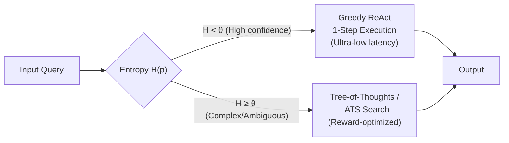
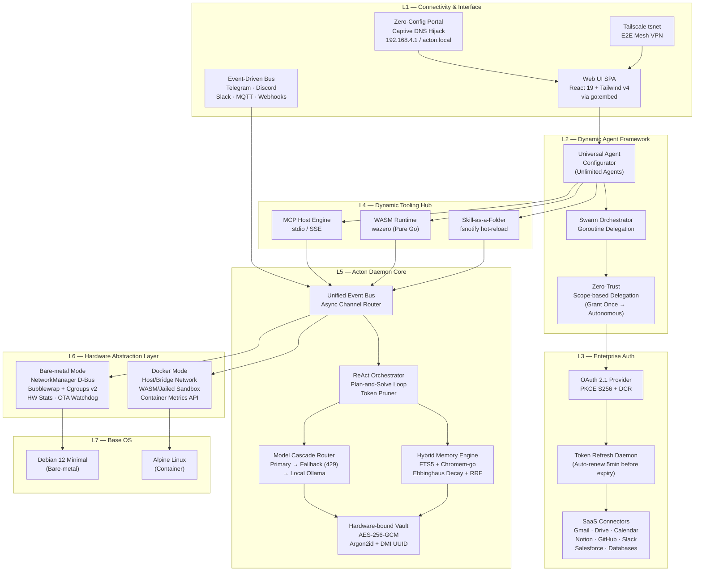
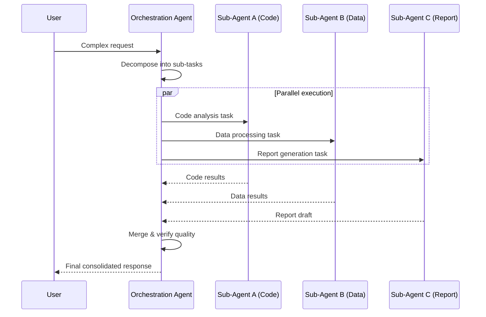
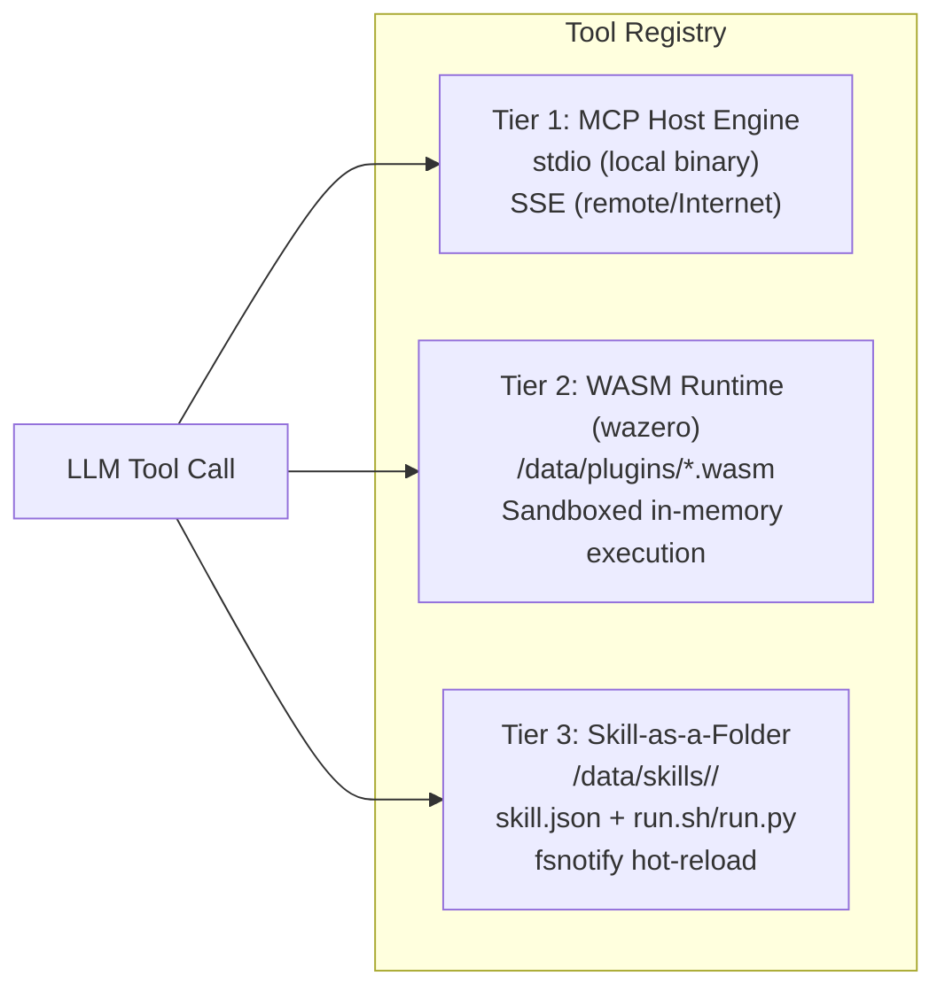
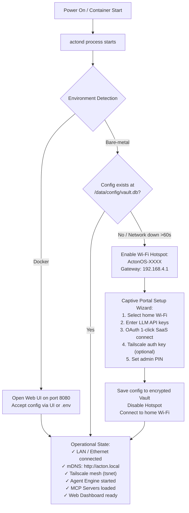
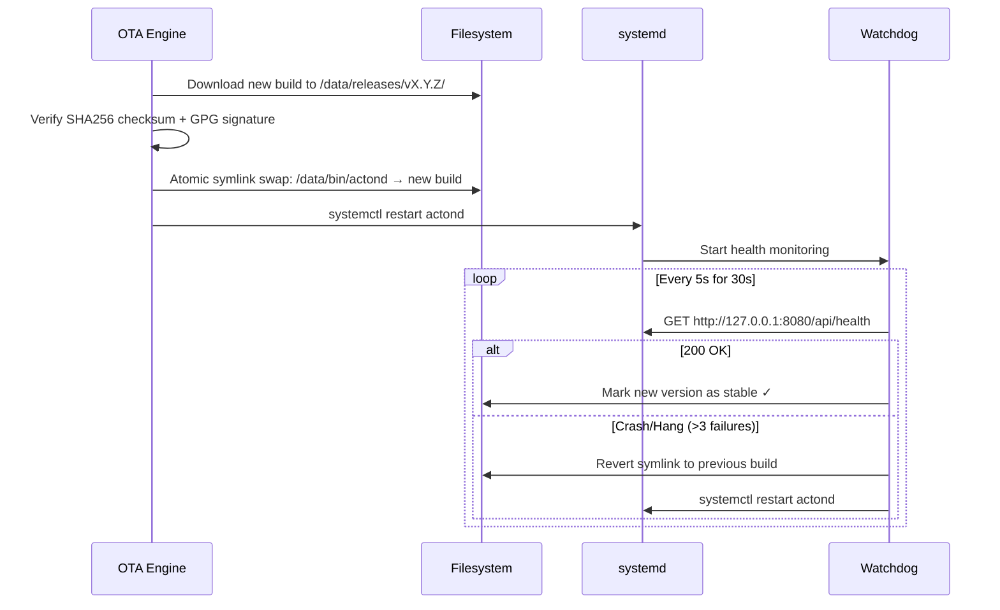

# ActonOS Architecture

> **Comprehensive Technical Architecture Specification**
> for the ActonOS Extensible AI Agent Operating System Kernel

---

## Table of Contents

- [1. Design Philosophy & Foundational Principles](#1-design-philosophy--foundational-principles)
- [2. Computational Cognition Models](#2-computational-cognition-models)
- [3. Master System Architecture](#3-master-system-architecture)
- [4. Universal Agent Framework](#4-universal-agent-framework)
- [5. Dynamic Tooling Hub](#5-dynamic-tooling-hub)
- [6. Security, Sandboxing & Audit Logging](#6-security-sandboxing--audit-logging)
- [7. Disk Partitioning & Dual-Runtime Model](#7-disk-partitioning--dual-runtime-model)
- [8. Onboarding & Operational Lifecycle](#8-onboarding--operational-lifecycle)
- [9. Self-Healing OTA Update System](#9-self-healing-ota-update-system)

---

## 1. Design Philosophy & Foundational Principles

ActonOS is a **single-purpose appliance operating system** engineered as a customizable, self-governing AI agent kernel running 24/7. It does not hardcode roles or fixed tasks — instead, it provides an absolutely flexible infrastructure allowing users to create, configure, authorize, and extend any AI agent.

### Core Principles

| Principle | Description |
|:---|:---|
| **Single Static Binary** | The entire system — Agent Core, Web Server, Database, RAG Engine, Integration Hub, Web UI — compiles into a single static binary (`actond`) with `CGO_ENABLED=0`. |
| **Minimal Resource Footprint** | Idle RAM consumption of **20–40 MB**, Web UI boot time under **2 seconds** on Intel N-Series (N100/N95) or AMD Ryzen CPUs. |
| **Universal Agent Engine** | Unlimited agent creation. Users define persona, system prompt, tool bindings, delegation scopes, and LLM model per agent via Dashboard or REST API. |
| **Multi-Agent Swarm** | Agent-to-Agent delegation via Goroutines. A primary orchestration agent spawns specialized sub-agents for parallel long-running task chains. |
| **Dual-Runtime Model** | Hardware Abstraction Layer (HAL) auto-detects bare-metal (Wi-Fi, D-Bus, bwrap) vs. Docker (container metrics, jailed exec). |
| **Immutable OS** | Read-only system partition. All user data and agent configs reside in `/data`. Atomic OTA updates with watchdog auto-rollback prevent bricking. |
| **International Standards** | Deep integration with Model Context Protocol (MCP), OAuth 2.1 PKCE (S256), WebAssembly (WASM), and embedded Tailscale (`tsnet`). |

---

## 2. Computational Cognition Models

ActonOS provides a self-adjusting cognitive infrastructure for every user-created agent.

### A. Multi-Layered Memory Architecture

| Layer | Data Type | Storage Mechanism |
|:---|:---|:---|
| **Working Memory** | Scratchpad, current task state, temp variables, tool call results | In-memory (Goroutine context), freed on task completion |
| **User Profile Memory** | User profile, communication style, naming conventions, preferences | Auto-extracted via Async Reflection → Key-Value JSON + SQLite |
| **Procedural Memory** | Error handling history, optimized command sequences (best practices) | Stored as Workflow Patterns, injected into System Prompt on similar tasks |
| **Episodic Memory** | Past conversation/task journals with timestamps | SQLite FTS5 + Chromem-go vector indexing |

### B. Ebbinghaus Forgetting Curve Decay Model

Each memory fragment's retrieval score is computed using:

```
R(m, q, t) = α · D(t) · W(m) + β · CosSim(Embed(q), Embed(m))
```

Where:
- `D(t) = e^(-Δt/λ)` — Temporal decay factor (Δt = time since last retrieval, λ = decay rate)
- `W(m)` — Intrinsic importance weight assigned during extraction
- `CosSim(...)` — Cosine similarity between query and memory embeddings
- `α, β` — Normalized weights satisfying `α + β = 1`

### C. Uncertainty-Gated Decision Branching (POMDP)

Agents operate as adaptive POMDP systems based on decision entropy:



### D. Calibrated Hybrid Retrieval (Sigmoid-Normalized Fusion)

Merges lexical search (SQLite FTS5) and semantic search (dense vector) scores using sigmoid normalization for optimal retrieval quality.

### E. Deterministic Verification System

| Tier | Method | Behavior |
|:---|:---|:---|
| **Tier 1** | Static Analysis (Pure Go, ~0ms) | AST parsing (Shell/Python/JSON/SQL), path escape detection, schema validation. Blocks immediately on violation. |
| **Tier 2** | Semantic Verification | Content consistency check against user profile and original request. Activated for language-logic tasks. |

---

## 3. Master System Architecture



### Tech Stack Reference

| Subsystem | Technology | Rationale |
|:---|:---|:---|
| Core Daemon | Go (CGO_ENABLED=0) | Single static binary, Goroutine concurrency, instant startup |
| Frontend | React 19 / Tailwind v4 / Vite | Embedded via `go:embed`, compressed bundle <2 MB |
| Remote Access | `tsnet` (Tailscale) | Embedded mesh VPN, E2E encrypted, no port forwarding |
| Tool Protocol | Model Context Protocol (MCP) | Open standard for tool integration via stdio/SSE |
| Plugin Runtime | wazero (WASM) | Pure Go WASM runtime, no CGO, sandboxed |
| Auth | OAuth 2.1 (PKCE S256) | Industry-standard SaaS authentication |
| Sandbox | Bubblewrap + Cgroups v2 | Namespace isolation, resource limits |
| Storage | modernc.org/sqlite + chromem-go | Embedded relational (FTS5) + vector search |
| Vault | AES-256-GCM + Argon2id | Hardware-bound encryption (DMI UUID + CPU serial) |
| Base OS | Debian 12 / Alpine Linux | Driver support (bare-metal) / minimal image (container) |

---

## 4. Universal Agent Framework

### A. Agent Schema Manifest

Each agent is declared via JSON/YAML or the Web Dashboard:

```json
{
  "agent_id": "agent_dev_assistant_01",
  "name": "Senior Software Architect",
  "description": "Expert in architecture analysis, code generation, and automated testing",
  "avatar_icon": "code-bracket",
  "model_config": {
    "primary_model": "anthropic/claude-3-7-sonnet",
    "fallback_model": "google/gemini-2.5-flash",
    "temperature": 0.2
  },
  "system_instructions": "You are a Senior Software Engineer. Always validate code syntax and run unit tests in the sandbox before responding...",
  "authorized_tools": [
    "mcp_github_*",
    "wasm_code_formatter",
    "skill_run_bash",
    "native_file_ops"
  ],
  "delegation_scope": {
    "max_monthly_budget_usd": 100.0,
    "allowed_workspace_paths": ["/data/workspace/project_alpha/"],
    "require_human_approval_level": "High"
  },
  "trigger_rules": [
    { "type": "channel_mention", "channel": "telegram", "filter": "@dev_bot" },
    { "type": "cron_schedule", "expression": "0 8 * * 1-5" }
  ]
}
```

### B. Multi-Agent Swarm Delegation



---

## 5. Dynamic Tooling Hub



### OAuth 2.1 & Token Refresh Daemon

All SaaS connections (Gmail, Notion, Figma, GitHub) authenticate via OAuth 2.1 with PKCE (S256). The `token_refresher.go` daemon automatically renews access tokens **5 minutes before expiry** to maintain seamless connectivity.

---

## 6. Security, Sandboxing & Audit Logging

### A. Command Execution Sandbox (Bubblewrap + Cgroups v2)

When an agent executes shell commands on bare-metal:

**Resource Limits (Cgroups v2):**
- `memory.max`: **512 MB**
- `cpu.max`: **50000 100000** (50% of 1 core)
- `pids.max`: **30** child processes

**Namespace Isolation (Bubblewrap):**
```bash
bwrap \
  --ro-bind /usr /usr \
  --ro-bind /bin /bin \
  --ro-bind /lib /lib \
  --ro-bind /lib64 /lib64 \
  --proc /proc \
  --dev /dev \
  --unshare-all \
  --die-with-parent \
  --cap-drop ALL \
  --disable-userns \
  --bind /data/workspace /workspace \
  --setenv PATH "/usr/bin:/bin:/data/bin" \
  --chdir /workspace \
  --uid 1000 --gid 1000 \
  bash -c "<agent_command>"
```

### B. Risk-Based Approval Matrix

| Risk Level | Example Actions | Handling |
|:---|:---|:---|
| **Low (Read-Only)** | Search Notion, Read Gmail, Web fetch, View workspace files | **Auto-execute 100%** |
| **Medium (Scoped Write)** | Create code files, Write Notion pages, Edit Gmail drafts | **Auto-execute** within authorized workspace boundaries |
| **High (Destructive/Finance)** | Push to main, Modify production DB, Transfer funds, Send email | **Human-in-the-Loop**: Confirmation card sent to Telegram/Web UI |

### C. Audit Logging (OpenTelemetry)

All execution history is recorded in structured JSON-lines at `/data/logs/audit.jsonl`:

```json
{
  "timestamp": "2026-08-16T23:55:00Z",
  "trace_id": "9a8b7c6d5e4f3210123456789abcdef0",
  "agent_id": "agent_dev_assistant_01",
  "tool_name": "skill_run_bash",
  "risk_level": "Medium",
  "execution_time_ms": 142,
  "status": "Success"
}
```

---

## 7. Disk Partitioning & Dual-Runtime Model

### A. Bare-metal MiniPC Partitioning

The system auto-formats three partitions during USB installation:

```
[Drive: /dev/nvme0n1 or /dev/sda]
├── Partition 1: ESP (512 MB, FAT32) ──► /boot/efi (UEFI Bootloader)
├── Partition 2: System Root (4 GB, Ext4) ──► / (READ-ONLY: Kernel, Base OS, bwrap)
└── Partition 3: User Data (remaining) ──► /data (READ-WRITE, auto-expands)
    ├── bin/           Symlink to active actond build
    ├── releases/      /v1.0.0/actond, /v1.0.1/actond ...
    ├── config/        vault.db (encrypted API keys, user settings)
    ├── agents/        agent_manifests.json (user-created agents)
    ├── tokens/        oauth_tokens.vault (encrypted OAuth tokens)
    ├── storage/       app.db (SQLite chat logs, FTS5, vector index)
    ├── logs/          audit.jsonl (OpenTelemetry structured logs)
    ├── overrides/     Custom Web UI / prompt overrides
    ├── plugins/       WASM plugin files (.wasm)
    ├── skills/        Skill script folders (JSON + Shell/Python)
    ├── mcp-servers/   MCP server configs and binaries
    └── workspace/     Isolated agent read/write environment
```

### B. Docker Container Mode

```bash
docker run -d \
  --name actonos-agent \
  -p 8080:8080 \
  -v /local/acton-data:/data \
  -e RUNTIME_MODE=docker \
  --restart unless-stopped \
  actonos/actonos:latest
```

---

## 8. Onboarding & Operational Lifecycle



---

## 9. Self-Healing OTA Update System



---

## References

1. [Model Context Protocol — GitHub](https://github.com/modelcontextprotocol)
2. [MCP Go SDK — pkg.go.dev](https://pkg.go.dev/github.com/modelcontextprotocol/go-sdk/mcp)
3. [Bubblewrap — Debian manpage](https://manpages.debian.org/unstable/bubblewrap/bwrap.1.en.html)
4. [OAuth 2.1 — IETF Draft](https://datatracker.ietf.org/doc/html/draft-ietf-oauth-v2-1-11)
5. [wazero — Pure Go WASM Runtime](https://github.com/tetratelabs/wazero)
6. [chromem-go — Embeddable Vector Database](https://github.com/philippgille/chromem-go)
7. [modernc.org/sqlite — Pure Go SQLite](https://pkg.go.dev/modernc.org/sqlite)
