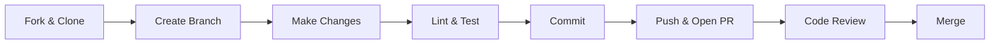

# Contributing to ActonOS

Thank you for your interest in contributing to ActonOS! This document provides guidelines and best practices for contributing to the project.

---

## Table of Contents

- [Code of Conduct](#code-of-conduct)
- [Getting Started](#getting-started)
- [Development Workflow](#development-workflow)
- [Branch Naming](#branch-naming)
- [Commit Conventions](#commit-conventions)
- [Pull Request Process](#pull-request-process)
- [Code Review Guidelines](#code-review-guidelines)
- [Release Process](#release-process)
- [Reporting Issues](#reporting-issues)

---

## Code of Conduct

This project follows the [Contributor Covenant Code of Conduct](https://www.contributor-covenant.org/version/2/1/code_of_conduct/). By participating, you agree to uphold this standard of conduct.

**In summary:** Be respectful, constructive, and inclusive. Focus on the work, not the person.

---

## Getting Started

1. **Fork** the repository on GitHub
2. **Clone** your fork locally:
   ```bash
   git clone https://github.com/<your-username>/actonos.git
   cd actonos
   ```
3. **Add upstream** remote:
   ```bash
   git remote add upstream https://github.com/actonos/actonos.git
   ```
4. **Set up** the development environment:
   ```bash
   make deps
   ```
5. See [docs/DEVELOPMENT.md](DEVELOPMENT.md) for detailed environment setup.

---

## Development Workflow



1. **Sync** with upstream before starting work:
   ```bash
   git fetch upstream
   git checkout main
   git merge upstream/main
   ```

2. **Create** a feature branch (see [Branch Naming](#branch-naming))

3. **Develop** your changes

4. **Lint and test** before committing:
   ```bash
   make lint
   make test
   ```

5. **Commit** using [Conventional Commits](#commit-conventions)

6. **Push** to your fork and open a Pull Request

---

## Branch Naming

Use the following format:

```
<type>/<short-description>
```

| Type | Purpose | Example |
|:---|:---|:---|
| `feat/` | New feature | `feat/swarm-delegation-timeout` |
| `fix/` | Bug fix | `fix/fts5-index-corruption` |
| `docs/` | Documentation | `docs/api-reference-update` |
| `refactor/` | Code refactoring | `refactor/llm-retry-middleware` |
| `test/` | Test additions/fixes | `test/oauth-token-refresh-edge-cases` |
| `chore/` | Maintenance tasks | `chore/update-go-dependencies` |
| `release/` | Release preparation | `release/v1.2.0` |

---

## Commit Conventions

This project uses [Conventional Commits](https://www.conventionalcommits.org/) (v1.0.0).

### Format

```
<type>(<scope>): <description>

[optional body]

[optional footer(s)]
```

### Types

| Type | When to Use |
|:---|:---|
| `feat` | New feature for the user |
| `fix` | Bug fix for the user |
| `docs` | Documentation changes only |
| `style` | Formatting, missing semicolons (no logic change) |
| `refactor` | Code change with no new feature or bug fix |
| `perf` | Performance improvement |
| `test` | Adding or fixing tests |
| `build` | Build system or dependency changes |
| `ci` | CI/CD pipeline changes |
| `chore` | Other maintenance (no production code change) |

### Scopes

Use the package name: `agent`, `auth`, `bus`, `channels`, `llm`, `tools`, `sandbox`, `memory`, `system`, `server`, `web`, `deploy`.

### Examples

```bash
feat(agent): implement swarm delegation with configurable timeout
fix(memory): prevent concurrent FTS5 write corruption
docs: update API reference with new agent endpoints
refactor(llm): extract retry logic into shared middleware
test(auth): add edge case tests for expired token refresh
build: upgrade Go to 1.23.2
```

### Breaking Changes

Append `!` after the type/scope, and include a `BREAKING CHANGE:` footer:

```
feat(agent)!: change agent manifest schema to v2

BREAKING CHANGE: The `tools` field is renamed to `authorized_tools`.
Migration guide: see docs/MIGRATION.md
```

---

## Pull Request Process

### Before Submitting

- [ ] Code compiles without errors (`make build-only`)
- [ ] All tests pass (`make test`)
- [ ] Linter reports no issues (`make lint`)
- [ ] New code has appropriate test coverage
- [ ] Documentation is updated if needed
- [ ] CHANGELOG.md is updated for user-facing changes
- [ ] Commit messages follow Conventional Commits

### PR Template

A PR template is provided at `.github/PULL_REQUEST_TEMPLATE.md`. Fill it out completely when opening your PR.

### Review Process

1. **Automated checks** run (lint, test, build)
2. **At least one maintainer** reviews the code
3. **Address feedback** by pushing additional commits
4. **Maintainer approves** and merges

### Merge Strategy

- **Squash and merge** for single-purpose PRs
- **Merge commit** for larger feature branches with meaningful history

---

## Code Review Guidelines

### For Authors

- Keep PRs **focused and small** (under 400 lines when possible)
- Write a **clear PR description** explaining the *why*, not just the *what*
- **Self-review** your diff before requesting review
- **Respond** to all review comments, even if just to acknowledge

### For Reviewers

- Be **constructive and kind** — suggest improvements, don't just criticize
- Distinguish between **blocking** issues and **nit** suggestions
- Focus on **correctness**, **readability**, **security**, and **performance**
- Approve promptly once issues are addressed

---

## Release Process

See [docs/VERSIONING.md](VERSIONING.md) for the full versioning strategy.

### Quick Overview

1. Ensure all changes are merged to `main`
2. Run the version bump script:
   ```bash
   # Patch release (0.1.0 → 0.1.1)
   make bump-patch

   # Minor release (0.1.0 → 0.2.0)
   make bump-minor

   # Major release (0.1.0 → 1.0.0)
   make bump-major
   ```
3. The script automatically:
   - Updates `VERSION` file
   - Adds a dated section to `CHANGELOG.md`
   - Creates a git commit and tag
4. Push the tag to trigger the release pipeline:
   ```bash
   git push origin main --tags
   ```

---

## Reporting Issues

### Bug Reports

Use the [bug report template](.github/ISSUE_TEMPLATE/bug_report.md) and include:

- ActonOS version (`make version` or `/api/health`)
- Runtime mode (Docker or bare-metal)
- Steps to reproduce
- Expected vs. actual behavior
- Relevant logs

### Feature Requests

Use the [feature request template](.github/ISSUE_TEMPLATE/feature_request.md) and describe:

- The problem you're trying to solve
- Your proposed solution
- Alternatives you've considered

### Security Vulnerabilities

**Do NOT file public issues for security bugs.** See [docs/SECURITY.md](SECURITY.md) for responsible disclosure procedures.

---

## Questions?

If you have questions about contributing, feel free to:

- Open a [Discussion](https://github.com/actonos/actonos/discussions) on GitHub
- Ask in the project's community channels
